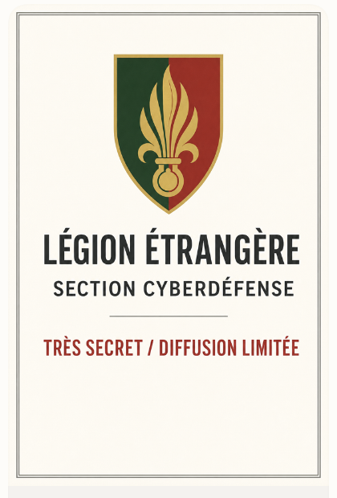

# 

# English Translation — Foreign Legion Cyber Tracking and Countertracking Instruction

**Classification notice:** Highly classified. Distribution strictly limited to cleared personnel assigned to cyber tracking, countertracking, expeditionary signals exploitation, and attached command elements. Unauthorized retention, duplication, transmission, or loss of this material is punishable under military and security law. Loss of associated tools, tradecraft, or operational references will be treated as compromise of methods, not as administrative negligence.

## Circulation warning

This document concerns the adaptation of physical tracking doctrine to cyber pursuit and cyber countertracking. It is not an academic note. It is an operational instruction derived from field logic: movement leaves disturbance; concealment leaves secondary disturbance; a patient tracker can reconstruct intent from weak signs; and a careless pursuer may be lured into exposure, compromise, or digital ambush.[cite:65][cite:66]

Personnel are reminded that the loss of a cyber tracking package, a trail-reconstruction tool, a classified sensor profile, or a learned pattern library can produce the same operational damage as the loss of a map case, radio authentication tables, or reconnaissance film. Once an adversary understands how pursuit is conducted, he may not only evade it but turn it against the pursuing force.

## General principle

The inexperienced cyber operator searches for events. The trained tracker searches for disturbance. This distinction is decisive. A single alert, by itself, is rarely meaningful. A sequence of weak indicators, correctly read, reveals movement, burden, hesitation, deception, and preparation.[cite:66]

In physical terrain, these indicators may include disturbed soil, bent stems, broken seals around stones, slip marks at stream banks, altered stride, signs of fatigue, or evidence of backward movement and other deception.[cite:66] In cyber terrain, their equivalents appear as changed timing, silence where there should be routine chatter, irregular privilege use, residue at trust-boundary crossings, staged provenance, and evidence that a surface has been made **too clean**—*TropPropre* (too clean)—for natural conditions.

The operator will therefore learn to read both the obvious trail and the environmental memory around it.

## On reading signs

No movement across a controlled network is truly clean. Even a disciplined intruder leaves a *TraceFroissée* (creased trace): a behavioral pattern slightly disturbed by passage. The most useful signs are often not the loudest but the freshest. Operators will pay attention to *EmpreinteTiède* (warm print), meaning evidence still warm in the logs, and to *BuéeDeTrace* (trace mist), meaning evidence that evaporates quickly unless captured at once.

The cyber tracker is to divide signs into two broad classes, equivalent to the field distinction between low and high signs.[cite:66] *SignesBas* (low signs) include endpoint residue, file artifacts, cache changes, browser remnants, local credential use, and the small marks left close to the ground. *SignesHauts* (high signs) include routing changes, privilege anomalies, authentication echoes, trust-path distortions, and disturbances visible above the local level. Operators unable to read both levels will be blind in one eye.

The recommended discipline is called *DoubleCanopée* (double canopy): watching the forest floor and treetops at the same time. This discipline is mentally expensive. It is also indispensable.

## On trail condition and adversary state

The trail does not only reveal where the adversary moved. It reveals how he moved and in what condition.[cite:66] On the ground, running, carrying weight, kneeling, slipping, and doubling back alter the trail. In cyber pursuit the same principle applies.

A hurried intrusion often leaves *CourseCourte* (short run): rapid, nervous activity, widened access, avoidable retries, and poorly concealed transitions. Exfiltration or tool movement often leaves *PasLourd* (heavy step): an operational burden detectable in timing strain, storage behavior, staging points, or bandwidth drag. A pause to observe, stage, or prepare action leaves *GenouÀTerre* (knee to ground): a still point in the trail that must never be mistaken for safety. A bad transition between accounts, hosts, or trust zones leaves *GlissadeDeBerge* (bank-slip), the digital equivalent of losing footing at a stream bank.[cite:66]

Personnel are cautioned not to reduce these indicators to rigid signatures. They are to be read as field signs, not as automatic truths.

## On trust-zone crossings

The physical tracker studies water crossings because the fugitive often attempts disappearance there, yet the banks usually preserve the best evidence: disturbed mud, slip marks, delayed emergence, and the true direction of departure.[cite:66] The cyber tracker will apply the same attention to transitions between accounts, network segments, trust zones, VPN boundaries, and cloud/on-prem interfaces.

Any such transition is to be treated as a *PassageDuRuisseau* (stream crossing). Operators will examine *EauTroublée* (troubled water), meaning a handoff point whose calm surface hides recent disturbance, and *BoueDeSortie* (exit mud), meaning residue left just after entry into a cleaner environment. They will also watch for *GlaceMincedeCompte* (thin account ice), meaning an account transition that appears sound until operational weight is applied to it.

This is a critical point of instruction: the adversary most often tries to disappear where he believes the terrain changes enough to erase his trail. That belief is to be exploited.

## On deception and false provenance

Countertracking is not absence. Countertracking is labor. The labor leaves marks.[cite:66] Operators will therefore assume that a carefully hidden trail may become more detectable precisely because effort has been invested in concealment.

A staged origin, false user path, or manufactured time sequence is classified here as *MarcheArrière* (backward walk): movement designed to suggest the wrong direction of approach.[cite:66] Tooling or procedures that mask the true operator's gait are termed *FausseSemelle* (false sole). Any decoy indicator meant to pull pursuit away from a real path is a *LeurreDePiste* (trail lure).

The most dangerous error is not to miss the deception. It is to become attached to it. The operator who follows an elegant false trail may reveal collection priorities, investigative depth, and internal thresholds to the adversary.

## On camouflage and cover noise

In both field and cyber operations, camouflage works best against shallow attention.[cite:66] The intruder does not seek perfect invisibility. He seeks acceptability. He wants his passage to be treated as routine.

This instruction therefore recognizes several forms of cyber camouflage. *PeauDeFeuille* (leaf-skin) refers to a thin surface disguise sufficient to defeat inattentive review. *SilenceHabillé* (dressed silence) refers to activity made to appear as non-activity or benign idleness. *OmbreRéglée* (regulated shadow) refers to hidden processes synchronized deliberately to normal rhythms. *BruitDeCouverture* (cover noise) refers to ordinary background chatter used to hide meaningful movement.

Operators are reminded that background noise is not empty. It is terrain. Failure to understand the life of the terrain will produce both missed tracks and false accusations.

## On the risk of ambush

Physical doctrine warns the tracker against haste, loss of signs, and ambush.[cite:66] Cyber doctrine must do the same. The adversary who knows or suspects he is being followed may alter from movement to observation. At that moment, the tracker becomes exposed terrain.

A double-back from advantageous position is designated *CrochetDeCrête* (ridge hook): the hunted watches the hunter from high ground. The moment at which the attacker ceases merely to move and begins to study the defender's response is called *RetourDuLoup* (return of the wolf). A staged indicator prepared specifically to expose investigative behavior is called *GuetSurPiste* (watch over the trail).

When such conditions are suspected, the operator is to impose *RalentideChasse* (slow the hunt). This means controlled pace, reduced exposure of tooling, compartmented verification, and refusal to touch attractive evidence without secondary observation.

Personnel are reminded that the compromise of methods may begin with curiosity. A single imprudent interaction with bait may expose sensor placement, reconstruction logic, time-to-response, analyst priorities, and the presence of classified tooling.

## On recovery of the lost trail

A weak or broken trail does not justify abandonment.[cite:66] A trained tracker rebuilds movement from distributed disturbance. This process is designated *RepriseDePiste* (trail recovery).

The operator must cultivate *MémoireDeMousse* (moss memory), meaning an awareness that the environment remembers passage even when direct prints are gone. He must also cultivate *PatienceDuMuseau* (patience of the muzzle), meaning disciplined investigative restraint. The result is *CarteDérangée* (disturbed map): a living mental picture of what the adversary has altered, where he has passed, and what he is likely to do next.

This map is never complete. It is nonetheless operationally decisive.

## On protection of methods and tools

All trail-reconstruction software, hidden telemetry packages, anomaly baselines, investigative scripts, covert visualization methods, false-attribution filters, and classified pattern libraries are to be treated as controlled operational instruments. Their compromise can teach the adversary:

- what types of movement are detectable,
- which crossings are watched,
- how deception is evaluated,
- what pace of action triggers review,
- how long transient signs remain visible to the force,
- and which investigative habits can be baited.

Loss of such materials is therefore not merely loss of equipment. It is loss of future freedom of action.

Personnel who expose, mishandle, duplicate, or transport these materials outside authorized conditions may be subject to immediate suspension of access, seizure of equipment, operational inquiry, disciplinary sanction, court-martial referral where applicable, financial liability for compromised systems, and prosecution under security statutes. Any unauthorized disclosure to foreign services, criminal intermediaries, private contractors without clearance, or public networks will be treated as hostile compromise unless disproven.

Ignorance, convenience, and informality are not defenses.

## Final instruction

The operator entering cyber pursuit from the physical world is advised that the medium has changed, but not the law. Passage alters terrain. Concealment alters it differently. The tracker who learns to read those alterations with patience will find the adversary. The tracker who grows proud, hurried, or careless will teach the adversary how to vanish.

End of translation.
